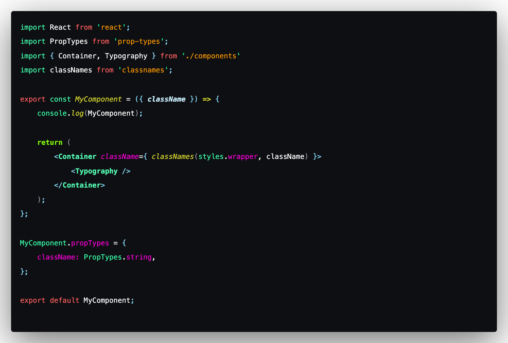
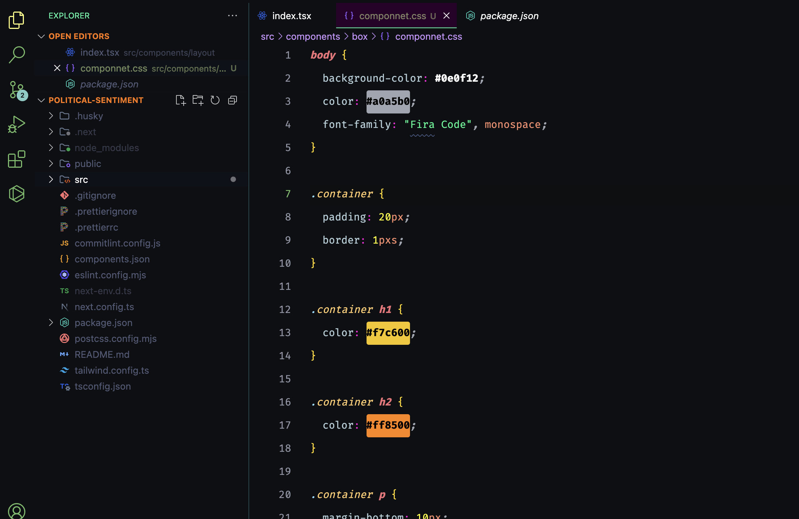
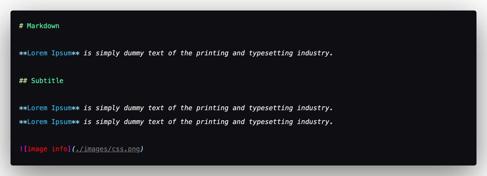

# Night Runner Theme

 A darked theme for your VSCode editor

 High contrast. Tailored for **React**.

## Installation

1. Open **Extensions** sidebar panel in Visual Studio Code. `View → Extensions`
1. Search for `Night Runner`
1. Click **Install**
1. File > Preferences > Color Theme > **Night Runner**

## Recommend font faces

Anonymous Pro, Fira Code